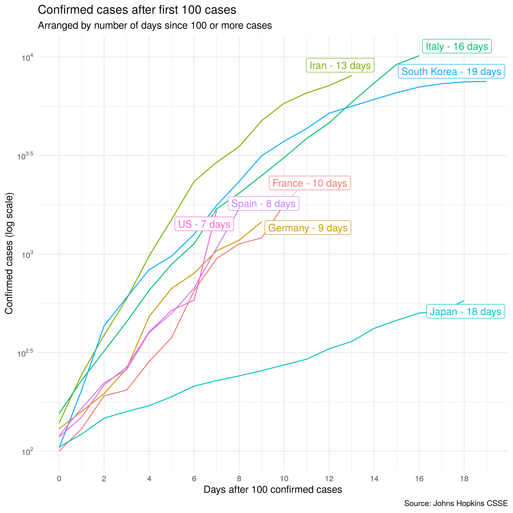

# 2020-corona

Repo with code for a shiny app to be able to interactively compare countries, etc. using the @JHUSystems + worldometers.info Coronavirus data.

Initially, using code from @JonMinton and @christoph_sax, this repo showed a simple visualization using the @JHUSystems updated Coronavirus data: 

+ Data: https://github.com/CSSEGISandData/COVID-19
+ Idea for plot: https://github.com/JonMinton/COVID-19
+ Most data preparation: https://gist.github.com/christophsax/dec0a57bcbc9d7517b852dd44eb8b20b

